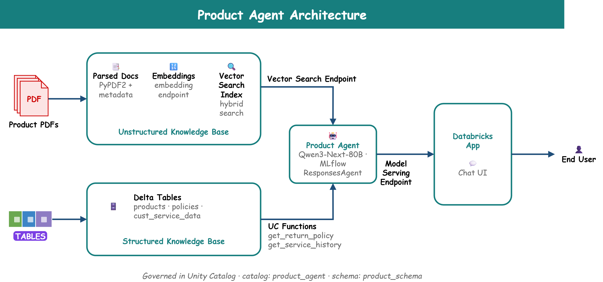
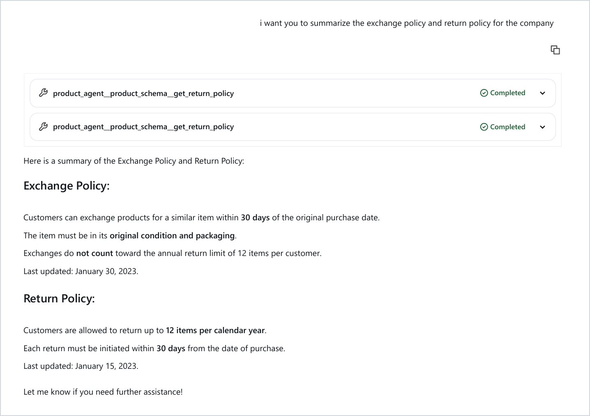
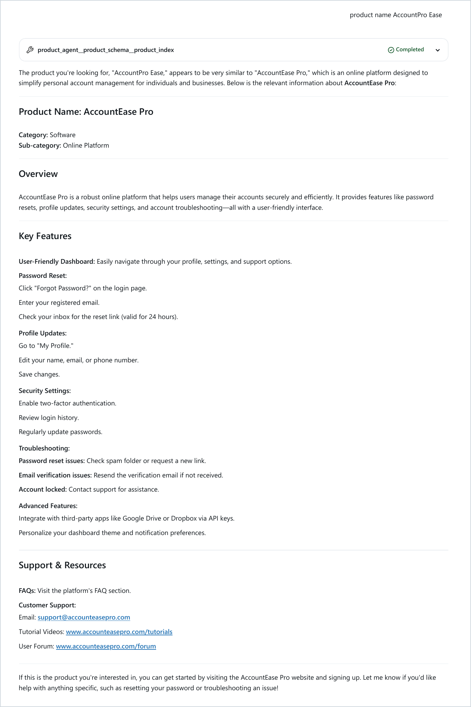

# Product-Agent

## Purpose
This system is a customer-service AI agent that answers questions about a company's products and policies, grounded entirely in the company's own data. Product manuals arrive as PDFs and are parsed, enriched with catalogue metadata, and indexed for hybrid vector search. Exact business facts (return, exchange, and warranty policies, and customer service history) live in Delta tables and are exposed to the agent as governed Unity Catalog SQL functions. A tool-calling agent built on MLflow's `ResponsesAgent` decides, per question, whether to search the documentation, call a function, or both. It is then evaluated, registered to Unity Catalog, deployed to a Model Serving endpoint, and put in front of users through a Databricks App chat interface.

## Architecture


## Data Flow
1. **Ingestion:** `02_Parse_PDF_Docs.py` reads every product PDF from a Unity Catalog Volume, extracts the text with PyPDF2, and writes one row per product to `product_docs`.
2. **Enrichment:** `03_Enrich_PDF_Files.py` joins each document to its catalogue record in `products` and wraps the result in XML-style tags (`<product_category>`, `<product_name>`, `<product_doc>`). The output goes to `product_docs_updated` with Change Data Feed enabled.
3. **Indexing:** a Vector Search Delta Sync index (`product_index`, on endpoint `product_search`) embeds `indexed_doc` and stays in sync with the source table incrementally through Change Data Feed.
4. **Tools:** `05_Create_User_Defined_Functions.py` registers two SQL table functions in Unity Catalog, `get_return_policy` and `get_service_history`, over the `policies` and `cust_service_data` tables.
5. **Agent:** `agent.py` defines a `ToolCallingAgent` that sends the conversation and tool specs to the LLM, runs any tool calls it emits (including parallel calls), feeds the results back, and loops until it has a final answer.
6. **Deployment:** `driver.py` tests the agent, logs it to MLflow with its resource dependencies, evaluates it, validates the packaged model, registers it to Unity Catalog, and deploys it to Model Serving.
7. **Serving:** a Databricks App provides the chat interface on top of the serving endpoint, showing each tool call inline as the agent works.

## Technologies Used
- **Databricks Unity Catalog:** a single governance layer for the Volume, tables, functions, vector index, and registered model, all under `product_agent.product_schema`.
- **Delta Lake:** storage for the source and enriched tables; Change Data Feed drives incremental index sync.
- **Mosaic AI Vector Search:** a Delta Sync index with managed embeddings, queried in hybrid (keyword + semantic) mode.
- **Unity Catalog Functions:** SQL table functions used directly as agent tools through `UCFunctionToolkit`.
- **Foundation Model APIs:** `databricks-qwen3-next-80b-a3b-instruct` as the reasoning and tool-calling LLM, called through an OpenAI-compatible client (`databricks-openai`).
- **MLflow 3:** `ResponsesAgent` interface, end-to-end tracing, GenAI evaluation scorers, and Unity Catalog model registry.
- **Mosaic AI Agent Framework:** `agents.deploy()` for Model Serving, with automatic authentication passthrough to declared resources.
- **Databricks Apps:** the chat front end.
- **PySpark / PyPDF2:** document parsing and table transformations.
- **Declarative Automation Bundles:** package the ingestion pipeline (`02_Parse_PDF_Docs` → `03_Enrich_PDF_Files`) as a scheduled two-task job, with `dev` and `prod` targets.

## Agent Tools

The agent is given three tools. It sees only each tool's name, description, and parameter schema, and picks between them per question.

| Tool | Called as | Returns | Responsibility |
| --- | --- | --- | --- |
| `product_index` | `VectorSearchRetrieverTool(query)` | top-k documents | Hybrid search over enriched product manuals: features, setup, troubleshooting, support contacts. Tolerant of misspelled product names. |
| `get_return_policy` | `get_return_policy(policy_name)` | `policy`, `policy_details`, `last_updated` | Exact lookup of a company policy: Return, Exchange, Refund, Warranty, Privacy, or Account Cancellation. |
| `get_service_history` | `get_service_history(user_email)` | `returns_last_12_months`, `issue_category`, `todays_date` | A customer's service-record counts, grouped by issue category. |

## Implementation

### Enrichment: metadata travels with the document
Each document is wrapped in its catalogue metadata before embedding, so the retriever can match on product name and category as well as body text:

```python
indexed_df = joined_df.withColumn(
    "indexed_doc",
    F.concat(
        F.lit("<product_category>"), F.col("product_category"), F.lit("</product_category>\n"),
        F.lit("<product_sub_category>"), F.col("product_sub_category"), F.lit("</product_sub_category>\n"),
        F.lit("<product_name>"), F.col("product_name"), F.lit("</product_name>\n"),
        F.lit("<product_doc>\n"), F.col("product_doc"), F.lit("\n</product_doc>"),
    ),
)
```

### Structured facts as governed SQL functions
Policies come from an exact SQL lookup rather than similarity search, so the agent always gets the current, authoritative row:

```sql
CREATE OR REPLACE FUNCTION product_agent.product_schema.get_return_policy(
    policy_name STRING COMMENT 'Policy name to return. Example policies: Account Cancellation Policy,
                                Exchange Policy, Refund Policy, Warranty Policy, Privacy Policy, Return Policy'
)
RETURNS TABLE (policy STRING, policy_details STRING, last_updated DATE)
LANGUAGE SQL
RETURN (
    SELECT policy, policy_details, last_updated
    FROM product_agent.product_schema.policies
    WHERE policy = policy_name
    LIMIT 1
);
```

The parameter `COMMENT` is part of the tool's schema: the LLM reads it to learn which values are valid.

### Tool registration: Unity Catalog and Vector Search, one interface
Both kinds of tool are normalised into a single `ToolInfo` (name, spec, executor), so the agent loop never needs to know where a tool's data comes from:

```python
UC_TOOL_NAMES = [
    "product_agent.product_schema.get_service_history",
    "product_agent.product_schema.get_return_policy",
]
uc_toolkit = UCFunctionToolkit(function_names=UC_TOOL_NAMES)
for tool_spec in uc_toolkit.tools:
    TOOL_INFOS.append(create_tool_info(tool_spec))

VECTOR_SEARCH_TOOLS = [
    VectorSearchRetrieverTool(
        index_name="product_agent.product_schema.product_index",
        tool_description="Searches the company's product documentation (user manuals and guides). ...",
    )
]
for vs_tool in VECTOR_SEARCH_TOOLS:
    TOOL_INFOS.append(create_tool_info(vs_tool.tool, vs_tool.execute))
```

### Agent loop: parallel tool calls handled correctly
The LLM can emit several tool calls in one turn. For example, "summarise the exchange and return policies" triggers two `get_return_policy` calls at once. Before the next LLM request, every pending call must have a result:

```python
def call_and_run_tools(self, messages, max_iter=10):
    for _ in range(max_iter):
        handled = {m["call_id"] for m in messages if m.get("type") == "function_call_output"}
        pending = [m for m in messages if m.get("type") == "function_call" and m["call_id"] not in handled]
        if pending:
            for call in pending:
                yield self.handle_tool_call(call, messages)
            continue

        last_msg = messages[-1]
        if last_msg.get("type") == "message" and last_msg.get("role") == "assistant":
            return

        yield from output_to_responses_items_stream(chunks=self.call_llm(messages), aggregator=messages)
```

Consecutive assistant messages are also merged into one before each request. That gives parallel tool calls the canonical single-message shape that some model providers require.

### System prompt: instruction-driven tool routing
Tool selection is steered by the system prompt, with explicit rules for when to search, when to look up a policy, and how to handle near-miss product names:

```python
SYSTEM_PROMPT = """You are a friendly, concise customer service assistant for our company.
## How to use your tools
- PRODUCT QUESTIONS: For ANY question about a product ... search the product documentation
  index BEFORE answering. Do this even if the product name looks misspelled ...
- POLICY QUESTIONS: Use the policy lookup tool with the exact policy name from this list ...
## How to answer
- Base every answer on tool results. Never invent product features, prices, URLs, or policy terms.
..."""
```

## Deployment

`driver.py` takes the agent from code to a live endpoint. Every Databricks resource the agent touches is declared at logging time, so the serving endpoint gets credentials to exactly those resources and nothing else:

```python
resources = [DatabricksServingEndpoint(endpoint_name=LLM_ENDPOINT_NAME)]
for tool in VECTOR_SEARCH_TOOLS:
    resources.extend(tool.resources)
for tool in uc_toolkit.tools:
    udf_name = tool.get("function", {}).get("name", "").replace("__", ".")
    resources.append(DatabricksFunction(function_name=udf_name))

with mlflow.start_run():
    logged_agent_info = mlflow.pyfunc.log_model(
        name="agent", python_model="agent.py", resources=resources, ...
    )

mlflow.set_registry_uri("databricks-uc")
uc_registered_model_info = mlflow.register_model(
    model_uri=logged_agent_info.model_uri, name="product_agent.product_schema.product_model"
)
agents.deploy(UC_MODEL_NAME, uc_registered_model_info.version, scale_to_zero=True)
```

Before registration, `mlflow.models.predict(..., env_manager="uv")` runs the packaged model in a clean environment. This catches missing dependencies before they can break a deployment.

## Agent in Action

**Policy lookup:** asked to summarise the exchange and return policies, the agent makes two parallel `get_return_policy` calls and merges the results into one answer: 30-day exchanges in original packaging, not counted toward the 12-item annual return limit.



**Fuzzy product search:** asked about "AccountPro Ease", the agent runs a hybrid search, recognises the closest match as **AccountEase Pro**, says so explicitly, and answers from that product's manual, including features, troubleshooting steps, and support links.



## Repository Structure
```
Product_Agent/
├── README.md
├── docs/images/                            # Architecture diagram and screenshots
└── product_agent/                          # Bundle root
    ├── databricks.yml                      # Bundle config: dev / prod targets, catalog & schema variables
    ├── resources/
    │   └── product.yml                     # Ingestion job: 02_Parse_PDF_Docs → 03_Enrich_PDF_Files
    ├── src/
    │   ├── 02_Parse_PDF_Docs.py            # PDFs in Volume → product_docs
    │   ├── 03_Enrich_PDF_Files.py          # Join with metadata → product_docs_updated (index source)
    │   ├── 04_Query_Index.ipynb            # Example hybrid similarity search
    │   ├── 05_Create_User_Defined_Functions.py   # UC functions used as agent tools
    │   ├── agent.py                        # ToolCallingAgent (MLflow ResponsesAgent)
    │   └── driver.py                       # Test → log → evaluate → register → deploy
    ├── pyproject.toml                      # Dev dependencies (pytest, ruff, databricks-connect)
    └── AGENTS.md / CLAUDE.md               # Guidance for AI coding assistants
```

## Unity Catalog Assets

All assets live under `product_agent.product_schema`.

| Asset | Type | Created by |
| --- | --- | --- |
| `customer_service` | Volume holding the product PDFs | Setup |
| `products`, `policies`, `cust_service_data` | Source Delta tables | Setup |
| `product_docs` | Parsed PDF text | `02_Parse_PDF_Docs` |
| `product_docs_updated` | Enriched, index-ready documents | `03_Enrich_PDF_Files` |
| `product_index` | Vector Search Delta Sync index | Setup |
| `get_return_policy`, `get_service_history` | SQL table functions (agent tools) | `05_Create_User_Defined_Functions` |
| `product_model` | Registered agent model | `driver.py` |

## Development Setup

**Prerequisites:** a Databricks workspace with Unity Catalog, serverless compute, Vector Search, and Foundation Model APIs enabled, plus the Databricks CLI, authenticated:
```bash
databricks auth login --host <workspace-url>
```

**Catalog, schema, and data:**
```sql
CREATE CATALOG IF NOT EXISTS product_agent;
CREATE SCHEMA  IF NOT EXISTS product_agent.product_schema;
CREATE VOLUME  IF NOT EXISTS product_agent.product_schema.customer_service;
```
Upload the product PDFs to `customer_service/01_Data_Files/product_docs/`, then load the `products`, `policies`, and `cust_service_data` tables. PDF filenames (without `.pdf`) should match `product_name` in `products`, since that is the join key.

**Pipeline:** run `02_Parse_PDF_Docs`, then `03_Enrich_PDF_Files`. These two notebooks are also the bundle's ingestion job, run in the same order.

**Vector index:**
```python
from databricks.vector_search.client import VectorSearchClient

vsc = VectorSearchClient()
vsc.create_endpoint(name="product_search", endpoint_type="STANDARD")
vsc.create_delta_sync_index(
    endpoint_name="product_search",
    index_name="product_agent.product_schema.product_index",
    source_table_name="product_agent.product_schema.product_docs_updated",
    pipeline_type="TRIGGERED",
    primary_key="product_id",
    embedding_source_column="indexed_doc",
    embedding_model_endpoint_name="databricks-gte-large-en",
)
```

**Tools and agent:** run `05_Create_User_Defined_Functions`, then `driver.py` top to bottom to deploy the agent.

**Chat UI:** create a Databricks App from the chatbot template and point it at the agent's serving endpoint.

## Design Notes
- **Structured and unstructured knowledge, kept separate.** Facts that must be exact, like policy terms and customer records, come from SQL functions. Open-ended product knowledge comes from retrieval. The agent never has to guess a return window from a loosely matching chunk of text.
- **Hybrid search, not pure semantic search.** Keyword matching alongside embeddings lets the agent recover from typos and transposed product names, such as "AccountPro Ease" → "AccountEase Pro", which pure vector similarity handles less reliably.
- **Metadata embedded with content.** Wrapping each document in category and product-name tags before indexing means queries like "your accounting software" can match on metadata, not just on words that happen to appear in the manual.
- **Incremental index sync.** Change Data Feed on the source table lets the Delta Sync index pick up changed rows without a full re-embed.
- **Tools governed in Unity Catalog, not embedded in the agent.** The agent holds no SQL and no table names. Functions carry their own permissions and lineage and can be reused by any other agent or dashboard in the workspace.
- **Least-privilege serving.** Declaring resources at logging time means the endpoint is granted access only to the LLM, index, and functions it actually uses.
- **Tool routing is driven by instructions.** Early testing without a system prompt showed the model asking users to clarify "Accountpro Ease" instead of simply searching for it, even though the search tool could handle it. The fix lives in the system prompt and tool descriptions, not the retrieval layer: the model needs to be told that searching is the default, not a last resort.
- **Everything traced.** Every LLM call and tool execution is captured as an MLflow trace, tagged with a session ID, so any answer can be traced back to the exact documents and rows it came from.
- **Scale-to-zero for a demo workload.** The endpoint scales to zero when idle to keep cost near nothing, at the price of a cold start on the first request.

## Roadmap
- A domain evaluation set (policy, product, misspelling, and out-of-scope cases) run through MLflow GenAI scorers on every change.
- Complete the bundle deployment of the ingestion job and add a Vector Search sync task after enrichment, so new PDFs reach the agent automatically.
- Lightweight CI: bundle validation and linting on every push, with evaluation-gated deployment as the next step.
